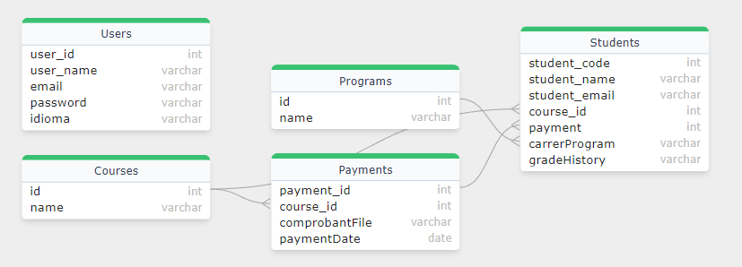

# Configuración de la Base de Datos y Uso de CORS

## 1. **Configuración de la Base de Datos MySQL**

### 1.1 **Acceder a MySQL**

Primero, abre una terminal o línea de comandos y accede a MySQL como el usuario root:

```bash
mysql -u root -p
```

Te pedirá la contraseña. Ingrésala y presiona `Enter`.

### 1.2 **Crear una Base de Datos**

Para crear una nueva base de datos, utiliza el siguiente comando SQL:

```sql
CREATE DATABASE CiucBD;
```

Este comando crea una base de datos llamada `CiucBD`. Puedes reemplazar `CiucBD` con el nombre que desees para tu base de datos.

### 1.3 **Cambiar la Contraseña del Usuario Root**

Para cambiar la contraseña del usuario `root`, utiliza el siguiente comando SQL:

```sql
ALTER USER 'root'@'localhost' IDENTIFIED BY 'nueva_contraseña';
```

Reemplaza `nueva_contraseña` con la contraseña deseada. Si deseas cambiarla nuevamente, puedes repetir el comando con la nueva contraseña:

```sql
ALTER USER 'root'@'localhost' IDENTIFIED BY '123456';
```

### 1.4 **Conceder Privilegios**

Para conceder todos los privilegios sobre la base de datos `CiucBD` al usuario `root`, utiliza el siguiente comando SQL:

```sql
GRANT ALL PRIVILEGES ON CiucBD.* TO 'root'@'localhost';
```

Esto asegura que el usuario `root` tenga acceso completo a todas las tablas de la base de datos `CiucBD`.

### 1.5 **Actualizar los Privilegios**

Después de realizar cambios en los privilegios, es una buena práctica actualizar la información de privilegios:

```sql
FLUSH PRIVILEGES;
```

### 1.6 **Salir de MySQL**

Para salir del monitor de MySQL, utiliza:

```sql
EXIT;
```

---

## 2. **Configuración y Uso de CORS**

CORS (Cross-Origin Resource Sharing) es un mecanismo que permite que los recursos de un servidor sean solicitados desde un dominio diferente al del servidor. En el contexto de desarrollo de APIs, se usa para permitir o restringir el acceso a la API desde diferentes orígenes (dominios).

### 2.1 **¿Por qué Añadir CORS?**

Cuando se realiza una solicitud desde un frontend alojado en un dominio diferente al del backend, el navegador bloquea la solicitud a menos que el servidor permita explícitamente el acceso mediante CORS. Esto ayuda a prevenir ciertos tipos de ataques, como el Cross-Site Request Forgery (CSRF).

### 2.2 **Configuración de CORS en Express**

Para permitir que tu frontend (por ejemplo, `http://localhost:5173`) se comunique con tu backend, debes configurar CORS en tu servidor Express. Esto se hace utilizando el middleware `cors`.

#### 2.2.1 **Instalación del Middleware**

Primero, asegúrate de que el paquete `cors` esté instalado en tu proyecto (ya estan actulizadas las dependencias en el archivo `package.json`):

```bash
npm install cors
```

#### 2.2.2 **Configuración de CORS en el Archivo `app.js`**
No es necesario tener la misma configuracion en el index.js, si quieres la quitas 😛.

En tu archivo de configuración del servidor Express (por ejemplo, `src/app/app.js`), añade y configura el middleware CORS:[aqui](./src/app/app.js)

### 2.3 **Descripción de la Configuración**

- **`origin`:** Especifica qué dominios pueden hacer solicitudes a tu API. En este caso, se permite solo `http://localhost:5173`. Puedes ajustar esta configuración para permitir múltiples dominios o todos los dominios (`'*'`) en un entorno de desarrollo.
- **`methods`:** Define qué métodos HTTP están permitidos. Los valores comunes son `GET`, `POST`, `PUT`, `DELETE`, etc.
- **`credentials`:** Permite el envío de credenciales como cookies y cabeceras de autorización con las solicitudes.

---

## 3. **Modularización de la Base de Datos**

La modularización de la base de datos se refiere a la organización de la estructura y el diseño de la base de datos en módulos o componentes separados para facilitar el mantenimiento y la escalabilidad.

### 3.1 **Estructura del Proyecto**

En tu proyecto, la base de datos puede estar organizada en módulos para manejar diferentes aspectos de la aplicación, como usuarios, productos, pedidos, etc. Por ejemplo:

```
src/
├── models/
│   ├── user.model.js
│   ├── product.model.js
│   └── order.model.js
├── controllers/ ---------------> podrias añadir esta carpeta para realizar las operaciones de la base de datos (o lo que neceites, es opcional, pero escala mejor)
│   ├── user.controller.js
│   ├── product.controller.js
│   └── order.controller.js
└── routes/
    ├── user.routes.js
    ├── product.routes.js
    └── order.routes.js
```

### 3.2 **Modelos**

Cada archivo en `models/` define un modelo para una entidad específica en la base de datos. Utiliza Sequelize para definir la estructura de las tablas y sus relaciones.

### 3.3 **Controladores**

Los archivos en `controllers/` contienen la lógica de negocio para cada entidad. Los controladores manejan las solicitudes y respuestas de la API y utilizan los modelos para interactuar con la base de datos.

### 3.4 **Rutas**

Los archivos en `routes/` definen las rutas de la API y las asocian con los controladores correspondientes.


## 4. **Relaciones en la Base de Datos**
Las relacion de la base de datos ya se han definido, en el archivo de 'database.js', he aqui un breve diagrama de las relaciones implementadas🤑🤑🤑🤑:
